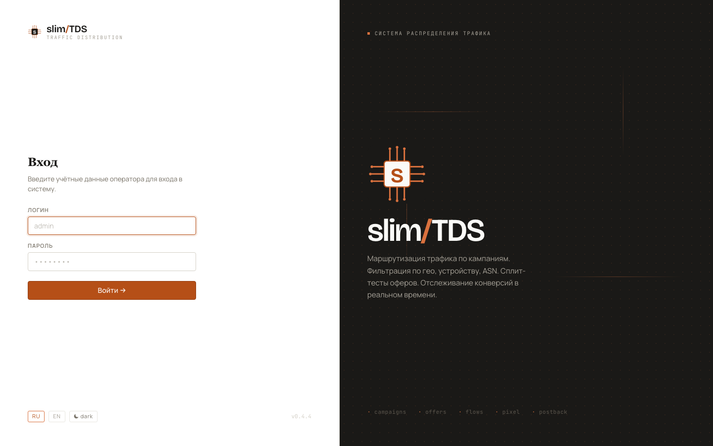
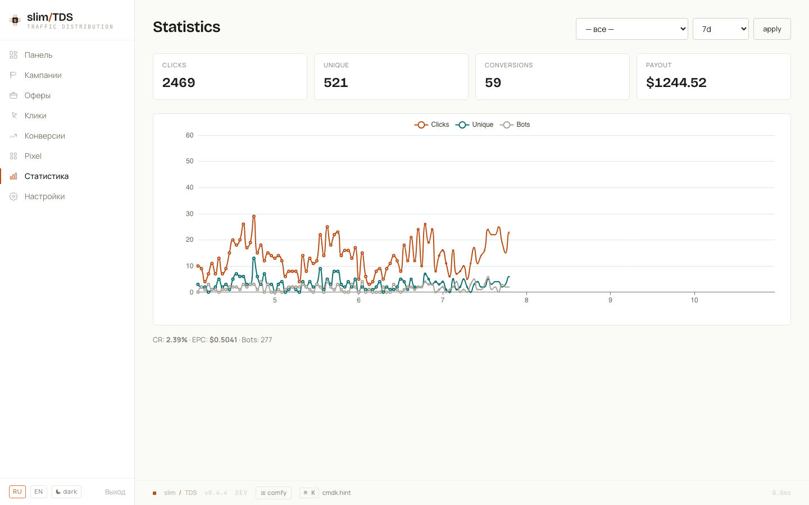

import { Steps } from '@astrojs/starlight/components';

## Requirements

- **Docker and Docker Compose** — any Docker engine (Docker Desktop, Rancher Desktop, or a plain Docker install)
- Nothing else installed on the host: PHP, PostgreSQL, and all runtime dependencies run inside Docker containers

## Install & run

<Steps>

1. **Clone the repository**

   ```bash
   git clone https://github.com/izzipizzy/slimtds.git slimtds
   cd slimtds
   ```

2. **Copy the environment template and generate secrets**

   ```bash
   make env
   ```

   This copies `.env.example` → `.env` and generates random values for `APP_SECRET` and `ADMIN_PASSWORD`. The admin password is printed to the terminal — note it down.

3. **Start the stack**

   ```bash
   make up
   ```

   Brings up three containers: `db` (PostgreSQL 18), `app` (FrankenPHP worker mode), and `cron` (supercronic job scheduler).

4. **Run database migrations**

   ```bash
   make migrate
   ```

   Runs Phinx against the dev database, creating all schemas, tables, partitions, and indexes.

5. **Seed development fixtures**

   ```bash
   make seed
   ```

   Idempotent — safe to run multiple times (skips if campaigns already exist). Creates:

   - **1 admin user** — login `admin`, password from `make env` output
   - **4 campaigns** — `casino` (iGaming / Casino), `dating` (Dating Smartlink), `nutra` (Nutra COD), `site` (slimTDS Site — pixel-only, no flows)
   - **5 global offers** — CIS Casino ($40), EU Casino ($60), Dating A ($4), Dating B ($6), Nutra COD ($12)
   - **7 flows** across the three traffic campaigns demonstrating geo routing, bot filtering, A/B splits, and cross-campaign offer reuse

</Steps>

## Log in

Browse to `/admin/login` on the host where you exposed slimTDS. Use login `admin` and the password shown in `make env` output (also stored in `.env` as `ADMIN_PASSWORD`). For details on TLS and serving options, see [Deployment](../deployment/).



## What you get

After seeding you have a fully working local instance: four campaigns with live slug URLs (`/casino`, `/dating`, `/nutra`, `/site`), five global offers wired through flows, and all admin views populated. The statistics dashboard shows click and conversion timeseries, KPI cards, and country/device breakdowns. To understand how traffic routing, campaigns, offers, and flows fit together, read [How a click is handled](core-concepts/).


