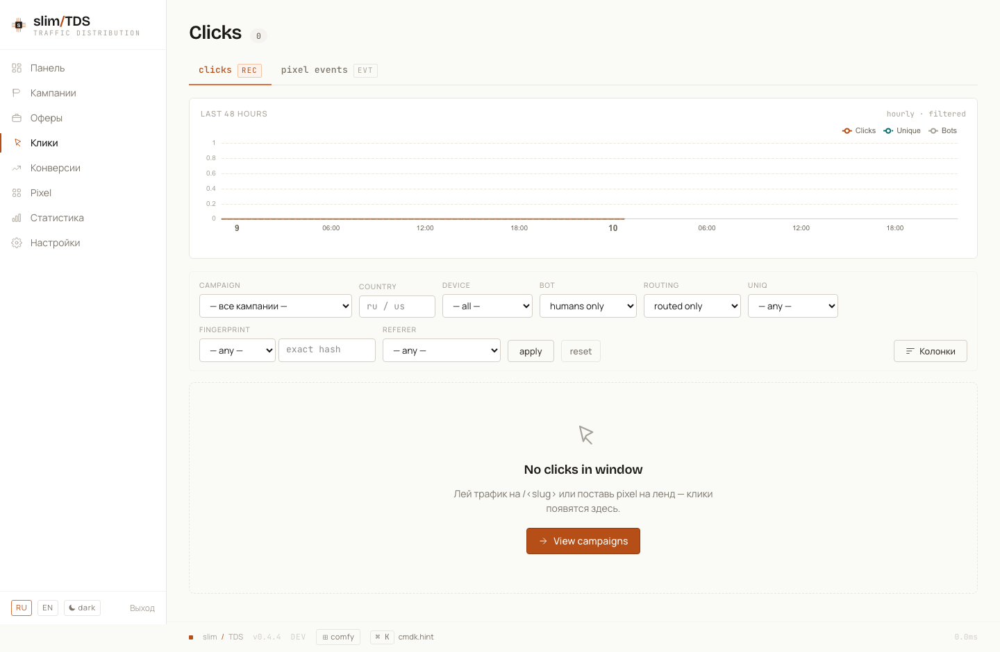

## Scheduled jobs

The `cron` container runs [supercronic](https://github.com/aptible/supercronic) against `docker/supercronic/crontab`. All commands are invoked as `php /app/bin/console <name>`.

| Command | Schedule | Purpose |
|---|---|---|
| `partitions:rotate` | `0 2 * * *` — daily at 02:00 UTC | Create partitions up to 2 months ahead; drop partitions older than the retention window |
| `rate_limits:cleanup` | `0 3 * * 0` — Sunday at 03:00 UTC | Delete expired rate-limit buckets from the database |
| `bots:update` | `0 5 * * *` — daily at 05:00 UTC | Refresh `core.bot_ips` from myip.ms bot IP list |
| `bots:update-extra` | `30 5 * * *` — daily at 05:30 UTC | Refresh `core.bot_asns` (brianhama bad-ASN list) and `core.bot_cidrs` (X4BNet datacenter + VPN CIDR lists) |
| `db:vacuum-stats` | `30 3 * * *` — daily at 03:30 UTC | `VACUUM ANALYZE` the current-month partition of each stats table |
| `geoip:check` | `0 6 * * *` — daily at 06:00 UTC | Check the GeoLite2 `.mmdb` files; logs a warning and exits non-zero if any is missing or older than 14 days (Telegram notification of stale GeoIP is delivered separately by the hourly `telegram:alerts` job) |
| `stats:refresh` | `*/5 * * * *` — every 5 minutes | Refresh the `stats.clicks_hourly` materialized view |
| `telegram:digest` | `0 10 * * *` — daily at 10:00 UTC | Send daily summary (clicks, conversions, revenue) to the configured Telegram chat |
| `telegram:alerts` | `0 * * * *` — every hour | Send system alerts (high bot rate, DB lag, etc.) to Telegram |
| `db:backup` | `0 1 * * *` — daily at 01:00 UTC | `pg_dump` in custom format; 14-day rotation |
| `postback:deliver` | `* * * * *` — every minute | Flush pending rows from `core.postback_deliveries` (outgoing S2S postbacks with exponential backoff retry) |
| `inbox:flush` | `* * * * *` — every minute | Drain `stats.pixel_events_inbox` → `stats.pixel_events` (GeoIP + UA enrichment); runs a 55-second inner loop so events surface within ~5–6 seconds |
| `rrweb:flush` | `* * * * *` — every minute | Drain `stats.rrweb_inbox` → gzipped `stats.rrweb_chunks` + upsert `stats.rrweb_sessions`; same 55-second inner loop so [session replays](../replays/) surface within a few seconds |

For details on how the bot detection lists are populated, see the [Bot detection section in Traffic Filtering](../traffic-filtering/#bot-detection).

## Partitions and retention

`stats.clicks`, `stats.pixel_events`, and `stats.visitors_fingerprints` are RANGE-partitioned by `created_at` in monthly intervals. Each partition also carries a BRIN index on `created_at` (except `visitors_fingerprints`, which uses a regular index on `fp_hash`). `stats.rrweb_chunks` (raw [session replay](../replays/) data) is partitioned **daily** instead, since it is high-volume and short-lived.

`partitions:rotate` (runs daily at 02:00 UTC) does two things:

1. **Creates ahead** — ensures partitions exist for the current month and the next 2 months (3 total).
2. **Drops expired** — removes partitions whose data falls entirely outside the configured retention window.

Retention defaults (applied if no override is stored in `core.settings`):

| Table | Default retention |
|---|---|
| `stats.clicks` | 365 days |
| `stats.pixel_events` | 90 days |
| `stats.visitors_fingerprints` | 30 days |
| `core.auth_events` | 180 days |

To change retention windows, use the General tab at `/admin/settings` — see [Settings & Notifications](../settings-notifications/#general--retention). Changes apply on the next `partitions:rotate` run.

To manually rotate partitions:

```bash
docker compose exec app php bin/console partitions:rotate
```

This is also required before running the integration test suite (`make test-up` calls it automatically against `db-test`).

## Backups

`db:backup` (daily at 01:00 UTC) runs `pg_dump --format=custom` and writes the dump to `/app/var/backups/` inside the app container. After each successful dump it scans for files older than 14 days and removes them, keeping at most 14 days of history.

To trigger a backup manually:

```bash
docker compose exec app php bin/console db:backup
```

To restore from a dump:

```bash
# List available dumps
docker compose exec app ls /app/var/backups/

# Restore (the 'yes' argument confirms the destructive operation)
docker compose exec app php bin/console db:restore <filename>.dump yes
```

No extra volume is needed for host-side copies: `docker-compose.yml` already bind-mounts `./var/backups` on the host to `/app/var/backups` in both the `app` and `cron` containers, so dumps land in the repository directory as they are written.


