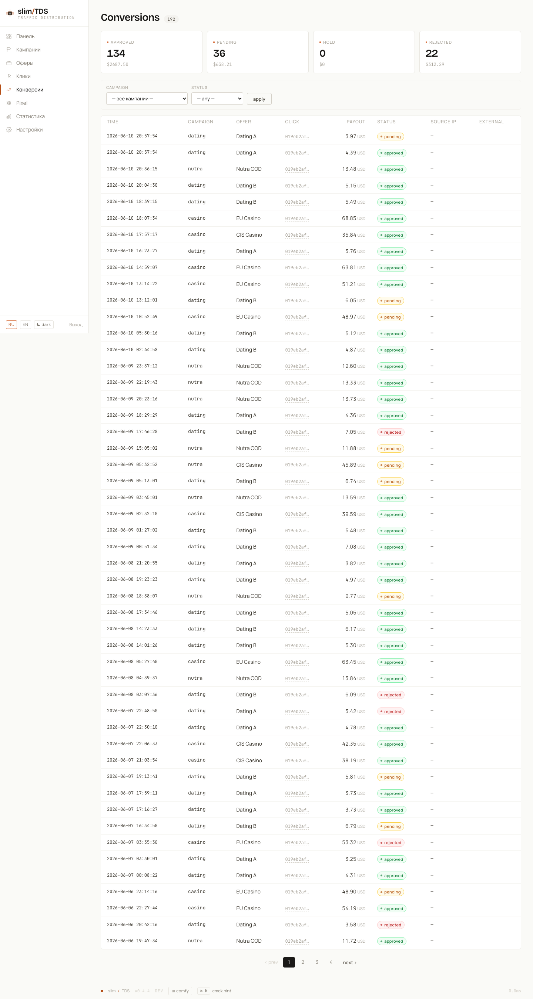

slimTDS handles two directions of postback traffic: **incoming** (partner networks notifying slimTDS of conversions) and **outgoing** (slimTDS forwarding conversion signals to your own tracking endpoints). Both are decoupled from the click pipeline so neither blocks visitor redirects.

## Incoming postbacks

Partner networks call `/postback` to report conversions. Both `GET` (query string) and `POST` (form-encoded or JSON body) are accepted. Query-string parameters take precedence over body keys when both are present.

### Parameters

| Parameter | Notes |
|-----------|-------|
| `token` | Postback token — **required**. Either a per-offer token or a campaign-level catch-all token. |
| `subid` | Click ID (`{click_id}` macro value placed in the offer URL). Required for offer-tokens; optional for campaign-tokens. |
| `payout` | Numeric payout amount (defaults to `0`). |
| `status` | One of `approved`, `pending`, `hold`, `rejected` (defaults to `approved`). |
| `external_id` | Partner's own conversion identifier (stored for cross-reference). |

### Token model

slimTDS resolves the token in two steps:

1. **Per-offer token** — each offer has a unique `postback_token` (a random 32-hex-char string). When this token is used, the conversion is attributed to that specific offer. The `subid` must be a valid click ID that was already recorded in `stats.clicks`.
2. **Campaign-level catch-all token** — each campaign also has a `postback_token` (a 32-hex UUID-derived string). This allows a single postback URL to handle any offer inside the campaign; the actual offer is resolved from the click row using `subid`. If no `subid` is supplied the ping is recorded as an **anonymous campaign conversion** (see below).

If the token matches neither an offer nor a campaign, the endpoint returns `404`.

### Idempotency

Conversions are upserted into `core.conversions` with a unique index on `click_id`. Sending the same `subid` twice updates `payout`, `status`, `external_id`, and `updated_at` rather than creating a duplicate row. PostgreSQL NULLs are treated as distinct, so multiple anonymous pings (no `subid`) can coexist without conflict.

### Anonymous campaign pings

When a campaign-level token is used without a `subid` — for example, a partner's test button that does not propagate click IDs — slimTDS records a conversion row with `click_id = NULL` and `offer_id = NULL`, tied only to the campaign. This allows operators to count partner events even when per-click attribution is unavailable.

## Outgoing S2S postbacks

When a conversion arrives and the matched offer has one or more postback URLs configured (`postback_urls` JSONB array on `core.offers`), slimTDS enqueues one `core.postback_deliveries` row per URL. The row is created synchronously during the incoming postback request, but the HTTP call is never made from the request thread.

The `postback:deliver` cron command (schedule: `* * * * *`, every minute) picks up to 50 pending rows and fires each one as an HTTP GET via cURL. On success (HTTP 2xx or 3xx) the row is marked `delivered_at = now()`. On failure (4xx, 5xx, or network error) the attempt count is incremented and the next retry is scheduled at an exponentially increasing delay.

### Retry schedule

Delays are indexed by attempt number (0-based). Up to 5 total attempts are made.

| Attempt | Delay before retry |
|---------|--------------------|
| 1st retry | 1 minute |
| 2nd retry | 5 minutes |
| 3rd retry | 25 minutes |
| 4th retry | 2 hours |
| 5th retry | 10 hours |

After 5 failures the row is no longer picked up. Total retry budget is approximately 13.5 hours from the first failure.

## Postback URL macros

Postback URL templates are expanded before delivery. The following tokens are supported:

:::caution[Outgoing postback tokens — limited set]
In **outgoing** postback URL templates, only five tokens carry meaningful conversion data: `{click_id}`, `{payout}`, `{status}`, `{external_id}`, and `{currency}`. Don't use anything else in outgoing postback URL templates — the delivery worker builds a bare context with only the click ID, so:

- **geo, device, lander, UTM, `{campaign_slug}`, `{visitor_uuid}`, `{referer}`, `{rand:…}`, `{randstr:…}`** — token is left **literal** in the fired URL (e.g. `&country={country}`).
- **`{ip}`** — placeholder `0.0.0.0`, not the click's IP.
- **`{ua}`** — placeholder `-`, not the click's User-Agent.
- **`{timestamp}`** — the **delivery time**, not the click time.

The full macro set is available in **offer URL templates**, which are expanded by `ClickHandler` as the click is handled, when all visitor context is present.
:::

| Token | Resolves to | Available in outgoing postbacks |
|-------|-------------|--------------------------------|
| `{click_id}` | The click ID (UUIDv7) originally passed as `{click_id}` in the offer URL | Yes |
| `{payout}` | Payout amount from the incoming postback | Yes |
| `{status}` | Conversion status (`approved`, `pending`, `hold`, `rejected`) | Yes |
| `{external_id}` | Partner's `external_id` value | Yes |
| `{currency}` | Currency code from the offer (e.g. `USD`) | Yes |
| `{visitor_uuid}` | Persistent visitor UUID | No — left literal |
| `{country}` | ISO 3166-1 alpha-2 country code | No — left literal |
| `{region}` | Region / subdivision | No — left literal |
| `{city}` | City name | No — left literal |
| `{device}` | Device type (`mobile`, `tablet`, `desktop`) | No — left literal |
| `{os}` | Operating system | No — left literal |
| `{browser}` | Browser name | No — left literal |
| `{lang}` | Accept-Language value | No — left literal |
| `{ip}` | Visitor IP address | No — placeholder `0.0.0.0` |
| `{ua}` | User-Agent string | No — placeholder `-` |
| `{referer}` | HTTP Referer | No — left literal |
| `{lander_host}` | Originating lander hostname | No — left literal |
| `{lander_domain}` | Lander domain without TLD | No — left literal |
| `{lander_button}` | Lander button/path segment | No — left literal |
| `{campaign_slug}` | Campaign slug | No — left literal |
| `{timestamp}` | Unix timestamp | No — delivery time, not click time |
| `{utm_source}` | UTM source | No — left literal |
| `{utm_medium}` | UTM medium | No — left literal |
| `{utm_campaign}` | UTM campaign | No — left literal |
| `{utm_term}` | UTM term | No — left literal |
| `{utm_content}` | UTM content | No — left literal |
| `{rand:MIN-MAX}` | Random integer between MIN and MAX | No — left literal |
| `{randstr:N}` | Random Base58 string of length N | No — left literal |

Unrecognised tokens are left as-is in the URL.
