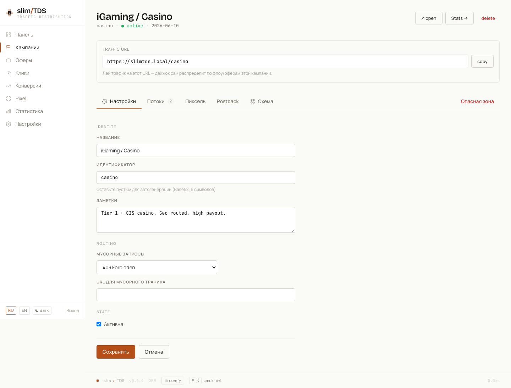
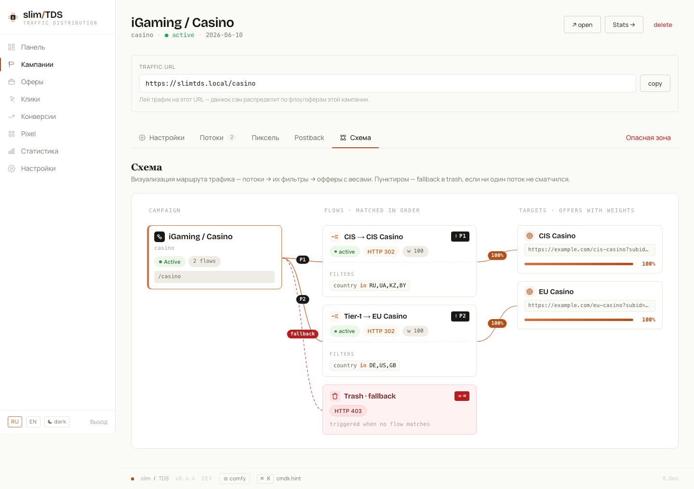

Кампания — это единица, вокруг которой строится ваш трафик. У неё есть живой URL `/<slug>`, набор упорядоченных потоков, решающих, какой оффер увидит каждый посетитель, и поведение по умолчанию для трафика, который не подошёл ни под один поток. Эта страница проводит вас через настройку кампании от начала до конца в воркспейсе админки.

## Создание кампании

Кампания создаётся из списка кампаний. Форма короткая:

| Поле | Примечания |
|-------|-------|
| `name` | Обязательное, до 120 символов. Только внутренняя метка — посетители её не видят. |
| `slug` / алиас | Необязательный кастомный алиас по шаблону `^[a-zA-Z0-9]{3,16}$`. Оставьте пустым — и slimTDS сгенерирует случайный 6-символьный slug в Bitcoin-Base58 (алфавит исключает похожие символы `0`, `O`, `I`, `l`). Slug **и есть** живой URL: `/<slug>`. |
| `notes` | Свободная внутренняя заметка. |
| `is_active` | Переключатель. Неактивная кампания перестаёт отдавать трафик. |

После сохранения кампания открывается во вкладочном воркспейсе: **Settings**, **Flows**, **Pixel**, **Postback**, **Diagram** и **Danger**. Всё описанное ниже живёт в одной из этих вкладок.

## Трэш-трафик

Клик, попавший на кампанию, но не совпавший **ни с одним потоком**, — это «трэш»: например, органика из гео, на которое не нацелен ни один поток, или бот, которого вы не хотите монетизировать. Поле кампании `trash_mode` (0–7) вместе с `trash_url` решают, что трэш получит: пустой 200, редирект 301/302/307, 403, 404, meta-refresh или JS-редирект. Редирект-режимы откатываются до пустого 204, если `trash_url` не задан.

`trash_url` проходит через макросы, поэтому токены вроде `{country}` или `{spin:…}` работают и здесь. Кроме того, поле принимает **ссылку `{offer:<name|id>}`** как всё своё значение (задаётся через выпадающий список офферов в Настройки → Трэш) — тогда трэш уходит на собственный (раскрытый по макросам) URL существующего оффера вместо руками вписанной ссылки. Ссылка разрешается сначала по UUID оффера, затем по точному имени; неразрешимая ссылка отдаёт `204`. Итоговая цель записывается как `out_url` клика в [логе кликов](../operations/). См. [Макросы](../core-concepts/#макросы).

Полную таблицу режимов смотрите в [Фильтрации трафика](../traffic-filtering/#трэш-трафик).

## Потоки

**Поток** — это одно правило маршрутизации внутри кампании: набор фильтров, один или несколько целевых офферов и схема ответа. Потоки проверяются сверху вниз по `position` (переставляйте их вверх/вниз в воркспейсе), и **побеждает первый совпавший поток** — поэтому ставьте самые специфичные потоки выше catch-all.

Каждый поток содержит:

- `name` — внутреннюю метку.
- `weight` — целое 0–1000 для относительного взвешивания потоков между собой.
- `is_active` — отключить поток без удаления.

В воркспейсе кампании потоки показаны **списком только для чтения**. Чтобы отредактировать фильтры, офферы и схему потока, вы открываете его на отдельной странице.

## Офферы и доли (веса)

В секции Target потока вы прикрепляете один или несколько **офферов**. Офферы глобальны — один и тот же оффер можно переиспользовать во многих кампаниях, — так что здесь вы направляете поток на существующие офферы. Каждая строка цели — это выпадающий список оффера плюс поле веса, вводимого в процентах.

**Вес — это доля показов оффера внутри потока.** Прикрепите два оффера с весами 70 и 30 — и примерно 70% трафика потока уйдёт на первый. UI суммирует веса всех строк и предупреждает, когда сумма не равна 100%.

Выбор **стабилен для посетителя**: UUID посетителя хешируется в постоянную точку распределения весов, поэтому один и тот же посетитель при повторных кликах всегда попадает на один и тот же оффер. Это держит ваши A/B-сплиты чистыми — вернувшийся посетитель не перескакивает между вариантами. Порядок разрешения смотрите в [Как обрабатывается клик](../core-concepts/).

## Фильтры

Фильтры потока — это **конструктор групп**: условия внутри группы соединяются по AND, а группы между собой — по OR. Пустые фильтры делают поток catch-all, совпадающим со всеми, — удобно в качестве последнего потока в списке.

Доступные поля:

| Группа | Поля |
|-------|-------|
| Гео | `country`, `region`, `city`, `asn` |
| Клиент | `device`, `os`, `browser`, `lang` |
| Качество | `is_bot`, `bot_name`, `is_uniq` |
| Источник | `referer`, `referer_domain`, `utm_source`, `utm_medium`, `utm_campaign`, `utm_term`, `utm_content` |
| Время / IP | `time_hour`, `day_of_week`, `ip_in_list` |

Операторы: `eq`, `neq`, `in`, `not_in`, `regex`, `gt`, `lt`, `between`, `exists`. Поле ввода значения зависит от выбранного поля — селекты для `device`/`os`/`browser`/`lang`/`day_of_week`/булевых, и текстовое поле с datalist для `country` и свободных полей.

**Разобранный пример** — направить мобильный трафик из России и Беларуси *или* любой трафик из Казахстана в один поток:

- **Группа 1:** `country in [ru, by]` **AND** `device = mobile`
- **OR Группа 2:** `country = kz`

Посетитель совпадает с потоком, если удовлетворяет любой из групп. Значение полей `is_bot` и `is_uniq` смотрите в [Фильтрации трафика](../traffic-filtering/).

## Схема ответа

Схема ответа решает, **как** совпавший посетитель будет доставлен на оффер. Вы **выбираете** один из 16 типов схем из выпадающего списка и **заполняете** его конфигурацию — ничего не генерируется автоматически.

Типы — это редиректы 301/302/303/307/308, Meta Refresh, Double Meta Refresh, iFrame, HTML Page, Show Text, JSON, Curl Proxy, No Action, HTTP Code, Formula и JS Redirect. Новый поток по умолчанию использует **302**.

Поля конфигурации появляются контекстно для выбранного типа:

- **URL редиректа** — используется, когда к потоку не прикреплён оффер (target = none);
- **тело HTML / текста / JSON** для типов, рендерящих страницу;
- **HTTP-код статуса** (например, `403`) для типа HTTP Code;
- для **JS Redirect** — режим (`replace` = без записи в историю браузера, `assign` = с сохранением истории) плюс задержка в миллисекундах.

Полный список типов схем — в [таблице схем](../core-concepts/#схемы-ответа).

## Диаграмма

Вкладка **Diagram** в воркспейсе визуализирует всю кампанию в одном виде: кампания → её потоки (с фильтрами каждого) → целевые офферы в виде столбиков весов → и маршрутизация трэша. Это самый быстрый способ убедиться, что трафик приходит туда, куда вы задумали, прежде чем запускаться.

