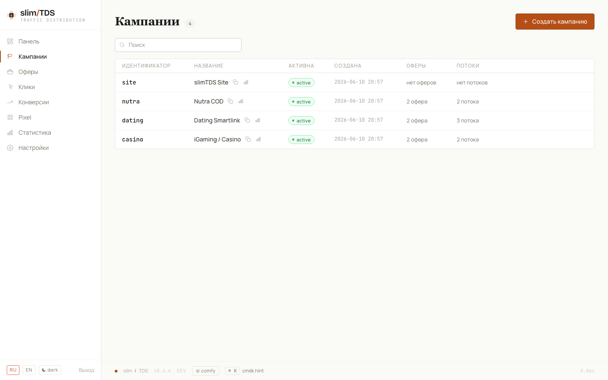

## Конвейер обработки клика

slimTDS пропускает ваш органический / SEO-трафик через TDS: каждый клик из поисковой выдачи или с SEO-лендинга попадает на `/<slug>`, где `slug` — идентификатор кампании. `ClickHandler` проводит клик через фиксированный конвейер обработки:

1. **VisitorResolver** — проверяет cookie `vu` на наличие существующего UUID посетителя. Если его нет, вычисляет 24-часовой фингерпринт (SHA-256 от IP + User-Agent + Accept-Language + секрет приложения) и ищет его в `stats.visitors_fingerprints`. Если и там не нашлось — генерирует новый UUIDv7 и записывает фингерпринт. Отдельный запрос проверяет `stats.pixel_events` на недавний (окно 30 дней) FingerprintJS CE visitor ID из пикселя на лендинге.
2. **DeviceDetector** — разбирает User-Agent и определяет тип устройства, ОС и браузер через `mobiledetectlib`.
3. **GeoLookup** — запрашивает базы MaxMind GeoLite2 City, Country и ASN, заполняя страну, регион, город, ASN и ISP. Молча ничего не делает, если файлы `.mmdb` отсутствуют в `geoip-data/`.
4. **BotDetector** — сверяет IP посетителя со списком IP-ботов и таблицей ASN, а User-Agent — с известными сигнатурами ботов. Список ежедневно обновляется cron-задачей `bots:update`.
5. **FlowMatcher + FilterCompiler** — перебирает активные потоки кампании по порядку. Для каждого потока `FilterCompiler` компилирует JSONB-структуру фильтра в PHP-замыкание и вычисляет его на контексте посетителя. Побеждает первое совпадение.
6. **OfferPicker** — выбирает оффер из списка `target_offers` сработавшего потока. Выбор основан на весе (доля показов, %) и стабилен для посетителя: UUID посетителя хешируется в постоянную точку распределения весов, поэтому один и тот же посетитель всегда попадает на один и тот же оффер.
7. **MacroExpander** — подставляет токены в URL оффера и в любые поля body/url конфигурации схемы (см. [Макросы](#макросы) ниже).
8. **Ответ схемы** — настроенный для потока тип схемы формирует HTTP-ответ (редирект, iframe, HTML и т. д.).
9. **Лог клика** — клик синхронно записывается в `stats.clicks` (RANGE-партиционирование по месяцам, BRIN-индекс по `created_at`) до того, как вернётся ответ.

## Модель данных

### Кампании

Кампания — точка входа для трафика. Её **slug** — это либо случайная 6-символьная строка в Bitcoin-Base58 (алфавит исключает `0`, `O`, `I`, `l`), либо кастомный алиас по шаблону `^[a-zA-Z0-9]{3,16}$`. Slug становится живым URL: `/<slug>`.

### Глобальные офферы

Офферы **глобальны** — они не принадлежат ни одной кампании. В таблице `core.offers` нет колонки `campaign_id`. Связь кампании с офферами целиком выводится из поля `target_offers` (JSONB) её потоков, что позволяет переиспользовать один оффер сразу во многих кампаниях.

### Потоки и фильтры

У каждой кампании один или несколько потоков, проверяемых по порядку. Поток содержит:

- **Фильтры** — JSONB-структуру `{ groups: [ { conditions: [...] } ] }`, где условия внутри группы соединяются по AND, а группы между собой — по OR. Пустой массив фильтров совпадает с любым посетителем (catch-all).
- **Целевые офферы** — список пар `{ offer_id, weight }`, где вес оффера — это его доля показов (%) внутри потока.
- **Схема** — как отвечать при срабатывании этого потока.




## Схемы ответа

Когда поток срабатывает, тип схемы определяет, как посетитель будет доставлен на оффер. В `SchemaRegistry` зарегистрировано **16 типов схем**:

| ID | Схема |
|----|--------|
| 1 | HTTP 301 Redirect |
| 2 | HTTP 302 Redirect |
| 3 | HTTP 303 Redirect |
| 4 | HTTP 307 Redirect |
| 5 | HTTP 308 Redirect |
| 6 | Meta Refresh |
| 7 | Double Meta Refresh |
| 8 | iFrame |
| 9 | HTML Page |
| 10 | Show Text |
| 11 | JSON |
| 12 | Curl Proxy |
| 13 | No Action (200 blank) |
| 14 | HTTP Code |
| 15 | Formula |
| 16 | JS Redirect |

Новые схемы добавляются регистрацией дополнительной записи в `SchemaRegistry`.

## Макросы

`MacroExpander` подставляет токены в URL офферов, шаблоны URL постбэков и поля body/url конфигурации схем во время запроса:

| Токен | Подставляется |
|-------|-------------|
| `{click_id}` | Идентификатор клика UUIDv7 |
| `{visitor_uuid}` | Постоянный UUID посетителя |
| `{campaign_slug}` | Slug кампании |
| `{country}` | Код страны ISO 3166-1 alpha-2 |
| `{region}` | Регион / субъект |
| `{city}` | Название города |
| `{device}` | Тип устройства (`mobile`, `tablet`, `desktop`) |
| `{os}` | Операционная система |
| `{browser}` | Название браузера |
| `{lang}` | Значение Accept-Language |
| `{ip}` | IP-адрес посетителя |
| `{ua}` | Строка User-Agent |
| `{referer}` | Заголовок HTTP Referer |
| `{bot}` | Имя бота (если обнаружен) |
| `{lander_host}` | Хост лендинга-источника |
| `{lander_domain}` | Домен лендинга без TLD |
| `{lander_button}` | Сегмент кнопки/пути лендинга |
| `{timestamp}` | Unix-таймстамп |
| `{utm_source}` | Параметр UTM source |
| `{utm_medium}` | Параметр UTM medium |
| `{utm_campaign}` | Параметр UTM campaign |
| `{utm_term}` | Параметр UTM term |
| `{utm_content}` | Параметр UTM content |
| `{rand:MIN-MAX}` | Случайное целое в диапазоне от MIN до MAX |
| `{randstr:N}` | Случайная Base58-строка длины N |
| `{spin:a\|b\|c}` | Равновероятный выбор из списка через `\|` |

Нераспознанные токены остаются без изменений.

### `{spin}` — ротация лендингов внутри одного оффера

`{spin:a|b|c}` на каждом запросе равновероятно выбирает одно из перечисленных через вертикальную черту значений. Пробелы вокруг значений обрезаются, пустые сегменты отбрасываются; если ничего валидного не осталось, макрос раскрывается в пустую строку — так литерал никогда не попадёт в URL. **Задать вес значению можно повторением** — `{spin:a|a|b}` вернёт `a` в двух третях случаев.

Поскольку макрос раскрывается везде, где работают макросы, типичное применение — ротация лендингов внутри одного оффера, без создания отдельного оффера на каждый лендинг:

```
{spin:https://land-a.example/go|https://land-b.example/go}
```

В отличие от весов офферов, `{spin}` **не** стабилен по посетителю — тот же посетитель при повторном клике может попасть на другое значение.

### `{offer:<name\|id>}` — ссылка на другой оффер

`{offer:...}` — это **ссылка**, а не инлайн-макрос, и распознаётся только как **всё значение** поля `trash_url` кампании (Настройки → Трэш). Она раскрывается в URL указанного оффера, который затем проходит через макросы — поэтому `{spin}`, `{click_id}` и прочее этого оффера отрабатывают как обычно. Ссылка сопоставляется сначала по UUID оффера, затем по точному имени (при совпадении имён побеждает новейший). Неразрешимая ссылка отдаёт посетителю `204`. См. [Трэш-трафик](../campaigns/#трэш-трафик).
