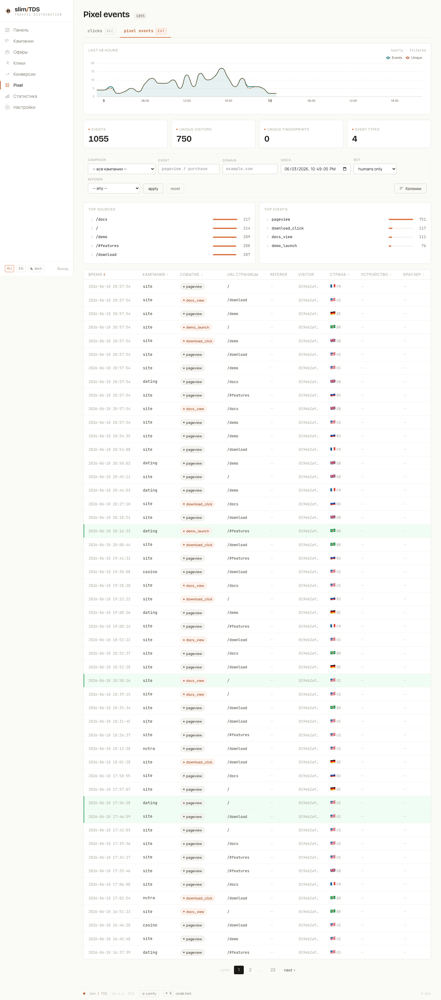

Пиксель slimTDS — это лёгкий JavaScript-сниппет, который идентифицирует посетителей на внешних лендингах, записывает события страниц и связывает эти события с кликами, прошедшими через TDS. Он построен на основе FingerprintJS Community Edition.



## Что такое пиксель

`GET /p.js` отдаёт скомпилированный скрипт пикселя (артефакт сборки Bun по адресу `public/p.js`). При загрузке скрипт автоматически генерирует FingerprintJS CE visitor ID и отправляет событие `pageview` на `/p/event`. Скрипт отдаётся с 5-минутным публичным кэшем (`Cache-Control: public, max-age=300, stale-while-revalidate=60`) и стандартной обработкой 304 на основе ETag, поэтому повторные загрузки быстрые.

## Встраивание пикселя

У каждой кампании есть страница пикселя по адресу `/admin/campaigns/{cid}/pixel`. Там показан сниппет для встраивания и кнопка копирования. Форма сниппета такая:

```html
<script async src="https://your-domain.com/p.js?c=CAMPAIGN_SLUG"></script>
```

Разместите тег в `<head>` или `<body>` каждого лендинга. Параметр запроса `?c=` — это slug кампании; он обязателен и привязывает события к нужной кампании.

### Кастомные события

После инициализации скрипта становится доступна функция `window.slimTDS.track()` для кастомных событий. На странице пикселя показан такой пример:

```js
window.slimTDS && slimTDS.track('purchase', { amount: 99, sku: 'X1' })
```

Первый аргумент — имя события; второй — произвольный объект свойств, который будет сохранён как есть в JSONB-колонке `props` таблицы `stats.pixel_events`.

### Запись сессий

Помимо событий, пиксель записывает визит с помощью [rrweb](https://github.com/rrweb-io/rrweb) и стримит запись на `POST /p/rec` чанками. В админке из них собираются просматриваемые реплеи — см. [Реплеи сессий](../replays/).

### Режим только pageview

Лендингам, которым нужны только просмотры и атрибуция источника входа, запись сессий можно отключить параметром `rec=0`:

```html
<script async src="https://your-domain.com/p.js?c=CAMPAIGN_SLUG&rec=0"></script>
```

Атрибут `data-rec="0"` на теге делает то же самое. Фингерпринт и событие pageview продолжают отправляться — не подключается только рекордер rrweb, а это основная часть работы пикселя на странице.

Это режим того же `/p.js`, а не отдельный скрипт: один URL для установки, один артефакт в кэше, на сервере менять нечего.

### Источник входа

На первой странице визита пиксель сохраняет **внешний** реферер в `sessionStorage` и подставляет его во все последующие pageview этой вкладки. Без этого `document.referrer` начинает указывать на сам лендинг, как только посетитель перешёл на внутреннюю страницу — именно так настоящий поисковый трафик становится неотличим от прямого, особенно за серверным редиректом `go.php`.

Значение попадает в `stats.pixel_events.entry_referer` и питает опциональные колонку и фильтр **Источник входа** в списке кликов. Реферер с того же хоста сохраняется как пустой, а не выдаётся за источник трафика.

## Отправка событий

События принимаются на `POST /p/event`. Тело может быть JSON (`Content-Type: application/json`) или form-encoded. Принимаемые поля:

| Поле | Тип | Примечания |
|-------|------|-------|
| `c` | string | Slug кампании — **обязательно** |
| `event` | string | Имя события (по умолчанию: `pageview`) |
| `fp` | string | `visitorId` FingerprintJS CE |
| `url` | string | URL текущей страницы |
| `ref` | string | URL реферера |
| `ua` | string | User-Agent (перекрывает заголовок, если задан) |
| `lang` | string | Язык браузера |
| `tz` | string | Строка таймзоны |
| `sw` | int | Ширина экрана |
| `sh` | int | Высота экрана |
| `t` | int | Клиентский Unix-таймстамп (информационно) |
| `props` | object | Произвольные кастомные свойства |

Ответы: `400`, если `c` отсутствует; `404`, если slug кампании неизвестен; `204` при успехе. Заголовок `Set-Cookie: vu=…` добавляется, когда запрос принадлежит новому посетителю.

### CORS

`/p/event` рассчитан на вызовы с любого внешнего домена лендинга. Поведение CORS:

- OPTIONS-preflight на `/p/event` возвращает `204` с разрешающими заголовками.
- Для фактических `POST`-запросов ответ возвращает заголовок `Origin` запроса обратно в `Access-Control-Allow-Origin` (а не `*`), чтобы ответ был валиден, когда браузер отправляет учётные данные — это необходимо, потому что `navigator.sendBeacon` с типизированным payload-ом `Blob` инициирует запрос с credentials.
- Когда заголовка `Origin` нет, используется `Access-Control-Allow-Origin: *`.
- `Access-Control-Allow-Credentials: true` добавляется при наличии `Origin`.
- `Access-Control-Max-Age: 86400` (24 часа) сокращает число preflight-обменов.
- Разрешённые методы: `POST, OPTIONS`. Разрешённые заголовки: `Content-Type`.

Сам скрипт (`GET /p.js`) тоже отдаётся с `Access-Control-Allow-Origin: *`.

## Куда попадают события

Обработчик запроса записывает строку с сырым payload-ом в `stats.pixel_events_inbox` — UNLOGGED промежуточную таблицу — и сразу возвращает ответ. В пути запроса не происходит ни GeoIP-поиска, ни разбора UA.

Cron-команда `inbox:flush` (расписание: `* * * * *`, каждую минуту) запускает цикл внутри одного процесса примерно на 55 секунд. На каждой итерации она читает до 500 строк из inbox, обогащает каждую данными GeoIP (MaxMind GeoLite2) и определением устройства/ОС/браузера, выполняет обнаружение ботов, затем вставляет в партиционированную таблицу `stats.pixel_events` и удаляет обработанные строки inbox. Поскольку команда повторно опрашивает каждые 5 секунд, когда inbox пуст, события обычно появляются в админке в течение **5–6 секунд** после поступления.

Как побочный эффект обработки очереди, если событие пикселя несёт FingerprintJS `visitorId`, а у посетителя был недавний клик, залогированный до того, как inbox был обработан, `inbox:flush` дозаписывает `fp_js` в эти строки кликов, чтобы связать два идентификатора посетителя задним числом.
