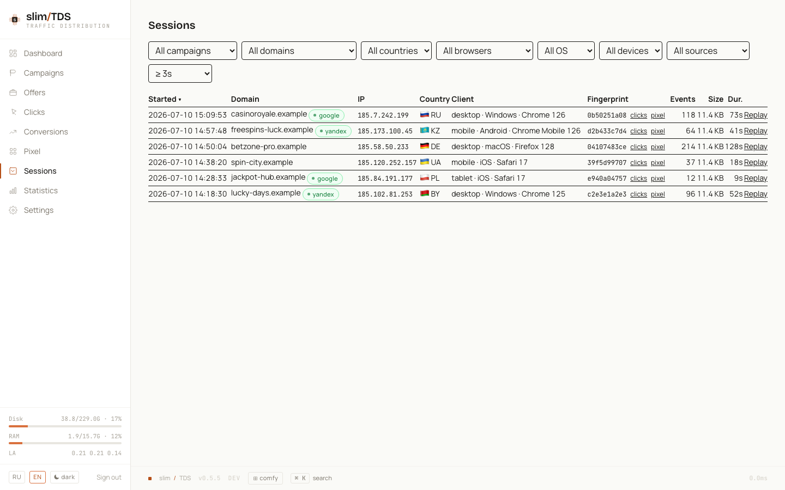
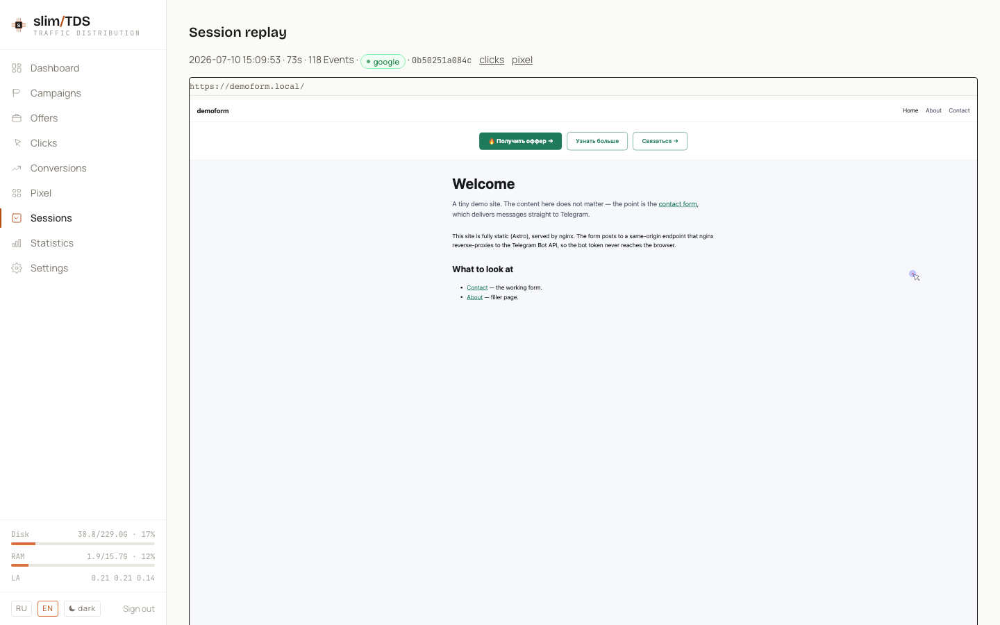

Реплеи сессий позволяют увидеть, что посетитель реально делал на вашем лендинге — движение мыши, скролл, клики и изменения DOM — восстановленное из записей [rrweb](https://github.com/rrweb-io/rrweb). Всё захватывает тот же [пиксель](../pixel/), который вы уже встраиваете, запись стримится на ваш собственный сервер и воспроизводится в админке. Ничего не покидает вашу инфраструктуру.

## Как работает запись

Когда пиксель загружается на лендинге, он вместе с обычным событием `pageview` запускает рекордер rrweb. rrweb сериализует исходный DOM, а затем поток инкрементальных мутаций. Пиксель группирует эти события в **чанки** и отправляет каждый чанк в TDS по ходу визита, поэтому длинная сессия появляется постепенно, а не только при закрытии вкладки.

Каждый чанк — небольшой запрос `POST /p/rec`:

| Поле | Тип | Примечание |
|------|-----|------------|
| `c` | string | Slug кампании — **обязательно** |
| `sid` | string | Клиентский id сессии (UUID) — **обязательно** |
| `seq` | int | Порядковый номер чанка внутри сессии |
| `events` | array | События rrweb этого чанка |
| `fp` | string | `visitorId` FingerprintJS CE, если доступен |
| `ref` | string | URL реферера |

Ответы: `400`, если отсутствует `c` или `sid`, иначе `204`. Неизвестные slug'и и слишком большие тела (один чанк ограничен **2 МиБ**) принимаются и молча отбрасываются — эндпоинт никогда не раскрывает, какие slug'и существуют. `/p/rec` использует тот же разрешительный [CORS](../pixel/#cors), что и пиксель, поэтому работает с любого внешнего домена лендинга, а кука `vu` читается, чтобы привязать запись к тому же UUID посетителя, что используется в остальном пайплайне.

## Обработка

Как и путь событий пикселя, запись никогда не делает тяжёлой работы в потоке запроса. Каждый чанк складывается в таблицу `stats.rrweb_inbox`, а cron-команда `rrweb:flush` её вычерпывает:

- Запускается каждую минуту с внутренним циклом ~55 секунд и повторным опросом каждые 5 секунд, поэтому записи становятся доступны в админке за несколько секунд после поступления.
- События каждого чанка сжимаются gzip и дописываются в `stats.rrweb_chunks`.
- В `stats.rrweb_sessions` upsert'ится строка на сессию, обогащённая страной GeoIP, устройством, ОС и браузером по IP и User-Agent чанка. Длительность выводится из таймстампов первого и последнего события rrweb; URL страницы берётся из первого Meta-события записи; счётчики чанков/событий и объём в байтах накапливаются по мере поступления чанков.
- Чанки, чей `sid` не является валидным UUID или чья кампания больше не существует, отбрасываются, чтобы одна плохая строка не отравила всю пачку.

## Просмотр реплеев

Раздел админки **Сессии** живёт по адресу `/admin/sessions`. Он выводит записанные сессии от новых к старым и фильтруется по кампании, фингерпринту (`fp`), домену, стране, браузеру, ОС, устройству и источнику трафика. По умолчанию сессии короче **3 секунд** скрыты (добавьте `min_dur=0` в URL, чтобы показать все), а список сортируется по времени старта или длительности.

Источник трафика берётся из реферера самой сессии, а при его отсутствии — из реферера событий пикселя посетителя (связь по фингерпринту).

Открытие сессии проигрывает запись во встроенном плеере rrweb — перематывайте таймлайн, следите за курсором и точно видьте, где посетитель замешкался или ушёл.

## Хранение и ретеншн

`stats.rrweb_chunks` партиционируется **посуточно** по `created_at`; `partitions:rotate` создаёт партицию на день вперёд, удаляет партиции за пределами окна хранения и подчищает устаревшие строки `stats.rrweb_sessions` (см. [Эксплуатацию](../operations/#запланированные-задачи)). Поскольку записи хранятся в gzip в вашем собственном PostgreSQL, данные реплеев остаются полностью self-hosted — никакого стороннего сервиса записи сессий не задействовано.
